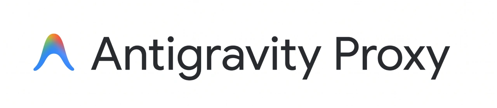

<div align="center">
  
  <p><b>Antigravity is shit. Gemini isn't.</b></p>
</div>

---

## What is Antigravity Proxy?

Google Antigravity provides access to frontier models like **Gemini 3.8 Flash (Tiered)**, **Gemini 3.5 Flash Lite**, **Claude Sonnet**, and **Claude Opus**, but normally restricts usage to official IDE extensions.

**Antigravity Proxy** brings your Antigravity account to Gemini-compatible applications. Run it locally or on your server, sign in with Google, and use a native **Gemini-to-Gemini** connection. It focuses on one thing: making Antigravity available through the Gemini API without converting requests and responses into another provider's format.

## One thing, done right: Gemini to Gemini

**Native Gemini requests in. Native Gemini responses out.**

This is deliberately not a universal API translator. There is no OpenAI or Anthropic conversion layer inside the proxy. Video inputs, tool calls, thinking metadata, thought signatures, and streaming responses stay in Gemini's native format instead of being reshaped to fit another API.

The narrow scope is the point: fewer format conversions, fewer opportunities to lose model-specific features, and a clear job for the proxy to do well. Gemini is the API protocol here, not a restriction to Google-branded models; Claude and other models available through Antigravity use the same interface.

Use a Gemini-compatible client directly. If your coding harness needs an OpenAI-compatible API, add a gateway such as [Bifrost](https://getbifrost.ai/) in front. Translation belongs in that optional layer, not in this proxy.

## Bring video to your Gemini workflows

**Native video input through your Antigravity account—not just text and images.** Send video clips to Gemini and ask it to summarize recordings, explain what happens on screen, or answer questions about a scene.

The proxy passes the video itself to Gemini rather than turning it into a collection of screenshots. Use a Gemini model that supports video understanding and a client that can send video inputs.

See the [video input guide](docs/api.md#multimodal--video-understanding) for examples and supported payloads.


## Features

- **Native Video Input**: Send video clips to compatible Gemini models through Antigravity for summaries, scene understanding, and questions about what happens in a recording.
- **No Hardcoded Model List**: Discover models directly from Antigravity and use newly available models without waiting for model-specific patches or proxy releases.
- **Optional Gateway Compatibility**: Use Gemini-compatible clients directly, or add [Bifrost](https://getbifrost.ai/) to connect OpenAI-compatible coding harnesses such as Aider, OpenCode, and Cline.
- **Live Quota & Limit Tracking**: Built-in `/status/limit` and `/status/usage` endpoints track your 5-hour and weekly bucket limits in real time.
- **One-Click Browser Login**: Interactive `login` command opens your browser, completes Google OAuth with PKCE, and handles token refresh automatically in the background.
- **Zero Leaks & Secure Auth**: Protect the proxy with a custom local `API_KEY`. Your Google OAuth tokens remain strictly on the proxy and are never exposed to clients.
- **Ultra Lightweight**: Single static Go binary with zero external runtime dependencies. Also available as a hardened scratch Docker image.

## Quick Start

### 1. Build the Binary
Requires Go 1.22+:

```sh
git clone https://github.com/sortedcord/antigravity-proxy.git
cd antigravity-proxy
go build -o antigravity-proxy ./cmd/antigravity-proxy
```

### 2. Authenticate with Google
Log into your Google account:

```sh
./antigravity-proxy login
```
This prints an authorization link and starts a local callback listener. Open the link in your browser, approve access, and the proxy automatically saves the OAuth credentials to `~/.config/antigravity-proxy/config.json`.

### 3. Start the Server
```sh
./antigravity-proxy serve
```
By default, the server listens at `http://127.0.0.1:8080`.

To set an authentication key or listen on all interfaces:
```sh
API_KEY="my-secret-key" HOST="0.0.0.0" ./antigravity-proxy serve
```

### 4. Test Generation
```sh
curl http://127.0.0.1:8080/v1beta/models/gemini-3.8-flash-tiered:generateContent \
  -H "x-goog-api-key: my-secret-key" \
  -H "Content-Type: application/json" \
  -d '{
    "contents": [
      {
        "role": "user",
        "parts": [{"text": "Hello! Reply with one short sentence."}]
      }
    ]
  }'
```

## Running with Docker

Run directly using Docker with your existing login config:

```sh
# Ensure the local history directory exists
mkdir -p "$HOME/.local/share/antigravity-proxy"

docker run -d \
  --name antigravity-proxy \
  --restart unless-stopped \
  -p 127.0.0.1:8080:8080 \
  -e API_KEY="my-secret-key" \
  -v "$HOME/.config/antigravity-proxy:/home/app/.config/antigravity-proxy:ro" \
  -v "$HOME/.local/share/antigravity-proxy:/home/app/.local/share/antigravity-proxy" \
  ghcr.io/sortedcord/antigravity-proxy:latest
```

See the [Deployment Guide](docs/deployment.md) for full Docker Compose configurations, non-root user setup, and production hardening.


## Connecting to Bifrost & AI Gateways

Need OpenAI Chat Completions (`/v1/chat/completions`) or Responses (`/v1/responses`)? Put [Bifrost](https://getbifrost.ai/) in front of the proxy. Bifrost accepts those formats and converts requests to the native Gemini API used by Antigravity Proxy. Cross-protocol translation stays in the gateway; the proxy remains Gemini-to-Gemini.

### 1. Configure Bifrost
Add Antigravity Proxy as a **Gemini** provider in Bifrost's `config.json` (or via the UI):

```json
{
  "providers": {
    "antigravity-proxy": {
      "keys": [
        {
          "name": "antigravity-key",
          "value": "env.ANTIGRAVITY_PROXY_API_KEY",
          "models": ["*"],
          "weight": 1.0
        }
      ],
      "network_config": {
        "base_url": "http://127.0.0.1:8080/v1beta",
        "allow_private_network": true
      },
      "custom_provider_config": {
        "base_provider_type": "gemini"
      }
    }
  }
}
```
*(Make sure `base_url` includes the `/v1beta` suffix and `ANTIGRAVITY_PROXY_API_KEY` matches your proxy's `API_KEY`.)*

### 2. Use in Any Coding Harness
Point your favorite tool (Aider, OpenCode, Cline, etc.) to your Bifrost gateway:

```sh
export OPENAI_BASE_URL="https://your-bifrost-domain/v1"
export OPENAI_API_KEY="sk-bf-your-virtual-key"
```

Then select any available model with your provider prefix:
- `gemini/gemini-3.8-flash-tiered`
- `gemini/gemini-3.5-flash-lite`
- `gemini/claude-sonnet-4-6`
- `gemini/claude-opus-4-6-thinking`


## Monitoring Quotas

Track your remaining 5-hour and weekly quotas at any time:

```sh
curl http://127.0.0.1:8080/status/limit -H "x-goog-api-key: my-secret-key"
```

Returns remaining percentages, active pools, and next reset timestamps:
```json
{
  "observed_at": "2026-10-07T09:59:38Z",
  "pools": {
    "gemini": {
      "display_name": "Gemini Models",
      "five_hour": { "remaining_percent": 99.8, "reset_at": "2026-10-07T12:20:15Z" },
      "weekly": { "remaining_percent": 99.8, "reset_at": "2026-10-11T16:02:27Z" }
    },
    "third_party": {
      "display_name": "Claude and GPT models",
      "five_hour": { "remaining_percent": 93.1, "reset_at": "2026-10-07T14:18:50Z" },
      "weekly": { "remaining_percent": 95.3, "reset_at": "2026-10-13T04:42:09Z" }
    }
  }
}
```

## Documentation

For comprehensive technical specifications and reference guides, check out:

- **[API Reference](docs/api.md)**: Full endpoint listing, streaming format, pagination, and video understanding.
- **[Configuration Guide](docs/configuration.md)**: Config schema, environment variable reference, and security controls.
- **[Deployment Guide](docs/deployment.md)**: Standalone Docker, Docker Compose, permissions, and network setup.
- **[Architecture & Design](docs/architecture.md)**: Deep dive into OAuth extraction, Cloud Code translation, and storage engine mechanics.

## Disclaimer

> **Account Risk**: This project is an unofficial integration with internal Google Antigravity endpoints. Google may enforce its Terms of Service, including account suspension. Use an account you can afford to lose. This project is not affiliated with or endorsed by Google.
