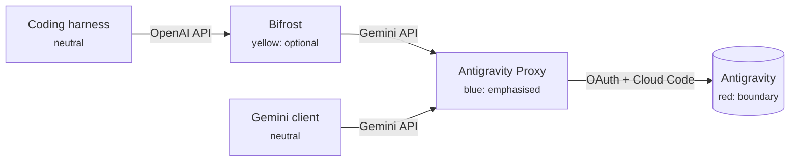

# Illustration design language

Illustrations for the README and docs. Each one is an HTML/CSS source in this directory that gets rendered to SVG in `docs/assets/illustrations/`.

```sh
./scripts/render-illustrations.sh   # chromium → PDF → pdftocairo → SVG
```

Reference implementation: [`model-access.html`](model-access.html), embedded as `docs/assets/illustrations/model-access.svg`.

## Principles

1. **White, quiet, and spacious.** The canvas is white. Most surfaces are neutral, and colour marks meaning. When in doubt, add whitespace rather than lines.
2. **Colour means something.** Every brand colour has a job (see [Colour roles](#colour-roles)). Don't use one just for decoration.
3. **One typeface, one weight.** Google Sans Regular only. Show hierarchy through size and colour. Never use bold: the TTF has no bold face, so Chromium would synthesise a smeared faux-bold.
4. **Round, soft, and flat.** Large radii, 1px hairlines, no drop shadows, no 3D effects.
5. **The logo gradient is a signature, not a fill.** Use it for at most one thin accent per illustration, such as the cap on the highlighted column.

## Canvas

| Token | Value | Use |
|---|---|---|
| Frame width | `960px` | Every illustration. GitHub scales it down in narrow columns. |
| Frame padding | `48px` | Outer whitespace inside the border. |
| Frame radius | `28px` | Outer card. |
| Frame border | `1px #DADCE0` | Keeps the white card clean on GitHub dark mode. |
| Grid | `4px` | All spacing: 4, 8, 12, 16, 24, 32, 48. |

Wrap every illustration in `<main class="frame">`. `page.js` sizes the PDF page to that element, so the SVG has no margins.

## Colour

### Neutrals

| Token | Hex | Use |
|---|---|---|
| `--canvas` | `#FFFFFF` | Background |
| `--surface` | `#F8F9FA` | Secondary cards, code blocks |
| `--surface-strong` | `#F1F3F4` | Neutral chips, inactive nodes |
| `--outline` | `#DADCE0` | Card borders, header rule |
| `--divider` | `#E8EAED` | Row separators |
| `--ink` | `#202124` | Primary text (matches the logo wordmark) |
| `--ink-secondary` | `#5F6368` | Ledes, labels, connector lines |
| `--ink-tertiary` | `#80868B` | De-emphasised numbers |
| `--ink-disabled` | `#BDC1C6` | "Not available" dashes |

### Brand

Each colour has three tones. **Fill** is for shapes. **Ink** is the text-safe version (≥ 4.5:1 on white). **Container** is for large tinted areas.

| Hue | Fill | Ink | Container |
|---|---|---|---|
| Blue | `#4285F4` | `#1A73E8` | `#E8F0FE` |
| Red | `#EA4335` | `#D93025` | `#FCE8E6` |
| Yellow | `#FBBC04` | `#B06000` | `#FEF7E0` |
| Green | `#34A853` | `#188038` | `#E6F4EA` |

Never use a fill tone for text. Yellow `#FBBC04` on white is roughly 1.7:1.

### Colour roles

| Colour | Means | Examples |
|---|---|---|
| **Blue** | The proxy, the primary path, Gemini | Highlighted column, the proxy node, request arrows |
| **Green** | Available, success, included | Check marks, healthy quota, "200 OK" |
| **Yellow** | Third-party or caution | Claude/GPT pool, tokens nearing a limit, optional gateway |
| **Red** | Google-side boundary, limits, failure | Antigravity backend node, exhausted quota, blocked path |
| Neutral | Everything else | Clients, inactive or competing options |

Use a hue for the same thing in every illustration. If blue is the proxy in one diagram, it stays the proxy in all of them.

### Signature gradient

```css
linear-gradient(90deg, #4285F4 0%, #34A853 35%, #FBBC04 65%, #EA4335 100%)
```

Limit it to one 4px element per illustration. The four-segment `.stripe` beside the eyebrow is the flat version and can go on every illustration.

## Typography

All text uses `font-weight: 400` with tabular numerals (`tnum`).

| Token | Size / line | Colour | Use |
|---|---|---|---|
| `--display` | 36 / 44, −0.5px | ink | Headline, one per illustration, ≤ 2 lines |
| `--stat` | 44 / 48, −1px | blue-ink or ink-tertiary | Hero numbers |
| `--title` | 22 / 28 | ink | Section or node titles in large diagrams |
| `--subtitle` | 17 / 24 | ink-secondary | Lede, column headers |
| `--body` | 15 / 22 | ink | Row labels, node labels |
| `--label` | 13 / 16, +0.2px | ink-secondary or blue-ink | Eyebrows, group headers, axis labels |
| `--caption` | 12 / 16, +0.2px | ink-secondary | Chips, footnotes, sublabels |

Use sentence case everywhere ("Model access", not "Model Access") and no trailing periods in labels. Keep ledes to one or two sentences.

## Shape

| Element | Radius | Stroke |
|---|---|---|
| Frame | 28px | 1px outline |
| Card / node / highlight | 16px | none or 1px outline |
| Small tile / code chip | 8px | none |
| Chip / pill / dot | full | none |
| Connector line | — | 2px, round caps |

## Components

All of these are defined in `tokens.css` unless a file is noted.

- **Eyebrow**: `.stripe` + 13px blue-ink label. Sits at the top-left of every illustration.
- **Chip**: 24px tall pill in a container colour with ink text (`.chip.blue`, `.green`, `.yellow`, `.red`, `.neutral`). On a tinted surface, add `.on-tint` to switch to a white fill.
- **Status icons**: green 24px filled circle with a white check (available). A 16×2px `--ink-disabled` dash means not available. Don't use red crosses for "not available": a missing feature in the other column is neutral, not an error.
- **Group header**: 8px brand-colour dot + 13px label. The dot follows the colour roles (blue for Gemini, yellow for third-party).
- **Highlight column** (`model-access.html`): `--blue-container` fill, 16px radius, with the signature gradient as a 4px cap inset 16px from each side.
- **Stat**: 44px number over a 12px caption. The winning number is blue-ink; the baseline is ink-tertiary.

## Diagrams and flowcharts

- **Nodes**: 16px-radius cards, `--canvas` fill with a 1px `--outline` border, 16–24px padding. Put a 24px icon or colour dot to the left of a 15px label, with an optional 12px sublabel below.
- **Emphasised node** (the proxy): `--blue-container` fill, no border, blue-ink title.
- **External boundary** (Google / Antigravity backend): dashed 1px `--outline` box with a 13px label in the top-left corner, 28px radius.
- **Connectors**: 2px lines in `--ink-secondary`, or `--blue` for the primary request path. Use orthogonal routing with 12px corner radii and filled 8px triangle arrowheads. Draw them as inline `<svg>` paths, not CSS borders.
- **Edge labels**: 12px caption on a white pill sitting on the line, e.g. `generateContent`, `OAuth`.
- **Flow direction**: left to right for request paths and top to bottom for sequences. Use one direction per diagram.
- **Density**: at most 7 nodes per diagram. Split anything bigger.

Example layout for the README's gateway section:



## Export constraints

The SVG comes from Chromium's PDF output via `pdftocairo`. Text turns into glyph outlines, so the result renders the same everywhere and needs no font on the viewer's machine. Some CSS features export badly:

| Avoid | Why | Use instead |
|---|---|---|
| `overflow: hidden` | Each clipped child gets its own `<clipPath>`. The reference went from 1.8 MB to 320 KB once it was removed. | Inset or round the child itself. |
| `box-shadow`, `filter`, `backdrop-filter` | Rasterised into an embedded `<image>` + `<filter>`, blurry and heavy | 1px `--outline` border |
| `font-weight` ≠ 400 | Synthesised faux-bold | Larger size or `--ink` vs `--ink-secondary` |
| Web images (`` PNG/WebP) | Embedded as base64 bitmaps | Inline `<svg>` icons |
| Transparent frame background | Unreadable on GitHub dark mode | Keep `.frame` white with its border |

Linear gradients, border radii, inline SVG, and dashed borders all export as clean vectors.

## Embedding

```html
<p align="center">
  
</p>
```

Because text is exported as outlines, it can't be searched or read by screen readers. The `alt` text has to carry the illustration's full message.
